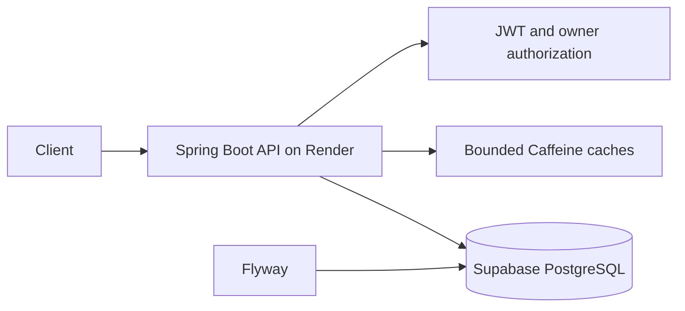

# URLSnap API

[](https://github.com/igorconrado/urlsnap-api/actions/workflows/ci.yml)

URLSnap is a backend-focused URL shortener built with Java 21 and Spring Boot. It demonstrates stateless authentication, resource ownership, PostgreSQL migrations, bounded local caching, request rate limiting, analytics, and containerized delivery.

## Architecture



PostgreSQL is the source of truth and Flyway owns the schema. A single API instance keeps redirect entries and fixed-window request counters in bounded Caffeine caches. Clicks are persisted asynchronously and aggregated by URL, day, and referrer.

## Features

- Registration and login with BCrypt password hashes and signed JWTs
- Authenticated creation, paginated listing, and deactivation of owned URLs
- Public redirects for active, non-expired links
- Optional alphanumeric custom codes and expiration timestamps
- Owner-only click totals, time windows, daily counts, and referrer statistics
- In-process redirect cache with configurable TTL and maximum size
- Concurrent fixed-window rate limiting with bounded client state
- OpenAPI, aggregate health endpoint, Docker, and GitHub Actions CI

## Security model

| Route | Access |
| --- | --- |
| `POST /api/auth/register`, `POST /api/auth/login` | Public |
| `GET /{shortCode}` | Public |
| `GET /`, `GET /actuator/health`, Swagger/OpenAPI | Public |
| `POST /api/urls`, `GET /api/urls` | Authenticated |
| `DELETE /api/urls/{id}` | URL owner |
| `GET /api/analytics/{shortCode}` | URL owner |

Authorization is deny-by-default. JWT secrets must contain at least 32 characters. Destination URLs accept only HTTP or HTTPS with a valid host and no embedded credentials. CORS origins are explicit. Forwarded headers are enabled only in the production profile, where Render is the trusted proxy.

Rate limiting applies to URL creation and returns `X-RateLimit-Remaining` and `X-RateLimit-Reset`. Counters are atomic within one JVM but are not distributed. Redis or another shared limiter would be required before running multiple replicas.

## Technology

Java 21, Spring Boot 3.5, Spring Security, Spring Data JPA, PostgreSQL, Flyway, Caffeine, JJWT, springdoc-openapi, Maven, JUnit 5, Mockito, Testcontainers, Docker, Render, and Supabase.

## Public API

The deployment URL will be added after the Render service is provisioned and validated.

## Run locally

Prerequisites: Java 21 and PostgreSQL 17.

```bash
cp .env.example .env
# Replace local placeholder values in .env
./mvnw spring-boot:run -Dspring-boot.run.profiles=local
```

On Windows, use `copy .env.example .env` and `mvnw.cmd`.

Swagger UI is available at `http://localhost:8080/swagger-ui.html`.

### Docker Compose

```bash
docker compose up --build
curl http://localhost:8080/actuator/health
```

Compose starts the API and PostgreSQL. Its credentials are local-only examples.

## Configuration

| Variable | Purpose | Production |
| --- | --- | --- |
| `DB_URL` | PostgreSQL JDBC URL, including required SSL options | Required |
| `DB_USERNAME`, `DB_PASSWORD` | Database credentials | Required |
| `JWT_SECRET` | Random signing secret, minimum 32 characters | Required |
| `JWT_EXPIRATION` | Token lifetime in milliseconds | `86400000` |
| `BASE_URL` | Public API origin used in responses | Required |
| `CORS_ALLOWED_ORIGINS` | Comma-separated browser origins | Required |
| `CACHE_MAXIMUM_SIZE` | Maximum cached redirects | `10000` |
| `CACHE_TTL_SECONDS` | Redirect-cache lifetime | `3600` |
| `RATE_LIMIT_MAX` | Requests allowed per client window | `10` |
| `RATE_LIMIT_WINDOW_SECONDS` | Fixed-window duration | `60` |
| `RATE_LIMIT_MAXIMUM_CLIENTS` | Maximum retained client counters | `10000` |
| `FORWARD_HEADERS_STRATEGY` | Proxy header handling | `FRAMEWORK` in production |

Profiles are `local`, `test`, and `production`. SQL logging is local-only. Production exposes only aggregate health information.

For Supabase, use the JDBC-compatible session pooler when direct IPv6 connectivity is unavailable. Keep the password separate from the URL and require TLS with `?sslmode=require`.

## API example

```bash
curl -X POST http://localhost:8080/api/auth/register \
  -H 'Content-Type: application/json' \
  -d '{"name":"Ada","email":"ada@example.com","password":"use-a-long-password"}'

curl -X POST http://localhost:8080/api/urls \
  -H 'Content-Type: application/json' \
  -H 'Authorization: Bearer <token>' \
  -d '{"originalUrl":"https://spring.io","customCode":"spring"}'
```

## Tests

```bash
./mvnw clean verify
./mvnw org.owasp:dependency-check-maven:check
docker build -t urlsnap-api .
```

Fast tests require no external service. The integration layer uses Testcontainers to apply Flyway migrations to clean PostgreSQL.

## Render deployment

1. Create a free Supabase project and copy its session-pooler connection details.
2. In Render, create a Blueprint from this repository or a free Docker Web Service from `main`.
3. Configure the variables listed above without committing their values.
4. Set `SPRING_PROFILES_ACTIVE=production` and health check `/actuator/health`.
5. After Render assigns a domain, set `BASE_URL` to that HTTPS origin and redeploy.

The free Render service may take approximately one minute to wake after inactivity. This is a platform cold start, not an application availability guarantee.

## Repository structure

```text
src/main/java/com/urlsnap/
  analytics/   click capture and aggregates
  auth/        users, JWT, registration and login
  config/      security, local rate limiting, OpenAPI and web configuration
  exception/   API error handling
  url/         shortening, redirects, bounded cache and ownership
src/main/resources/db/migration/  Flyway schema
src/test/                         automated and integration tests
.github/workflows/ci.yml
Dockerfile
docker-compose.yml
render.yaml
```

## Limitations

- Cache and rate-limit state are local to one instance and reset on restart or cold start.
- The fixed-window limiter is not suitable for horizontally scaled deployments without shared state.
- Render Free can sleep after inactivity and has no availability guarantee.
- Click recording is asynchronous but not backed by a durable event queue.
- IP addresses and user-agent data require an explicit retention and privacy policy before real user traffic.
- No production traffic, performance, scale, or availability claims are made.

## Roadmap

- Shared rate limiting if multiple replicas become necessary
- Durable click-event delivery
- Configurable analytics retention and privacy controls

## License

Licensed under the [MIT License](LICENSE).
