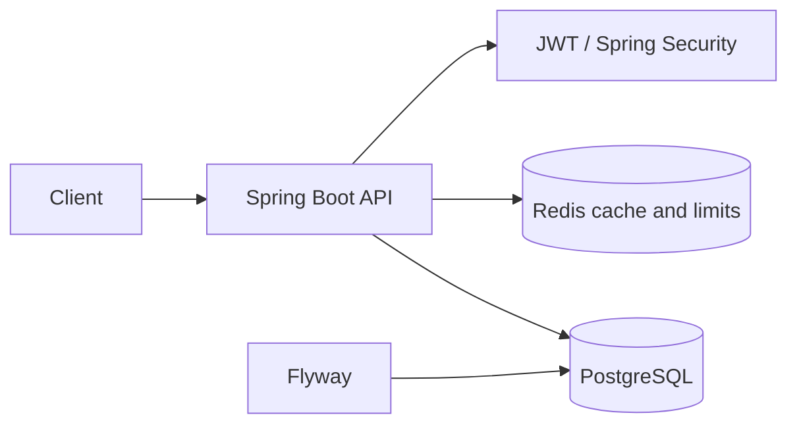

# URLSnap API

[](https://github.com/igorconrado/urlsnap-api/actions/workflows/ci.yml)

URLSnap is a backend-focused URL shortener built with Java 21 and Spring Boot. It provides authenticated link management, redirect caching, request rate limiting, and owner-only click analytics.

## Architecture



The API uses a stateless JWT security filter. PostgreSQL is the system of record; Flyway owns the schema. Redis stores one-hour redirect entries and atomic fixed-window rate-limit counters. Click events are persisted asynchronously and aggregated by URL, day, and referrer.

## Features

- Registration and login with BCrypt password hashes and signed JWTs
- Authenticated creation, listing, and deactivation of user-owned short URLs
- Public redirects for active, non-expired links
- Optional alphanumeric custom codes and expiration timestamps
- Owner-only click totals, time windows, daily counts, and top referrers
- Redis redirect cache and fixed-window rate limiting
- OpenAPI documentation and a minimal public health endpoint
- PostgreSQL migrations, containerized local stack, and GitHub Actions CI

## Security model

| Route | Access |
| --- | --- |
| `POST /api/auth/register`, `POST /api/auth/login` | Public |
| `GET /{shortCode}` | Public |
| `GET /`, `GET /actuator/health`, OpenAPI/Swagger | Public |
| `POST /api/urls`, `GET /api/urls` | Authenticated |
| `DELETE /api/urls/{id}` | URL owner |
| `GET /api/analytics/{shortCode}` | URL owner |

JWT secrets must be at least 32 characters and are never supplied by the application. Destination URLs accept only `http` and `https` with a valid host and no embedded credentials. CORS origins are explicit. Forwarded headers are disabled by default and enabled in the production profile for deployment behind a trusted platform proxy.

Rate limiting applies to URL creation and uses the servlet's resolved remote address. The Redis increment and expiry are executed atomically. The default failure policy is fail-open so a Redis outage does not make the core API unavailable; operators can set `RATE_LIMIT_FAIL_OPEN=false`. Rate-limit responses include remaining-window headers.

## Technology

Java 21, Spring Boot 3.5, Spring Security, Spring Data JPA, PostgreSQL, Flyway, Redis/Lettuce, JJWT, springdoc-openapi, Maven, JUnit 5, Mockito, Testcontainers, Docker, and GitHub Actions.

## Run locally

Prerequisites: Java 21, PostgreSQL 17, and Redis 7.

```bash
cp .env.example .env
# Replace placeholder values in .env
./mvnw spring-boot:run -Dspring-boot.run.profiles=local
```

On Windows, use `copy .env.example .env` and `mvnw.cmd`.

The API is available at `http://localhost:8080`; Swagger UI is at `http://localhost:8080/swagger-ui.html`.

### Docker Compose

```bash
docker compose up --build
curl http://localhost:8080/actuator/health
```

Compose starts the API, PostgreSQL, and Redis with isolated named volumes. Its credentials are local-only examples.

## Configuration

| Variable | Purpose | Required in production |
| --- | --- | --- |
| `DB_URL` | PostgreSQL JDBC URL | Yes |
| `DB_USERNAME`, `DB_PASSWORD` | Database credentials | Yes |
| `REDIS_URL` | Redis URI; supports `redis://` and `rediss://` credentials/TLS | Yes |
| `JWT_SECRET` | Random signing secret, minimum 32 characters | Yes |
| `JWT_EXPIRATION` | Token lifetime in milliseconds | No (`86400000`) |
| `BASE_URL` | Public API origin used in responses | Yes |
| `CORS_ALLOWED_ORIGINS` | Comma-separated browser origins | Yes |
| `RATE_LIMIT_MAX` | Requests per fixed window | No (`10`) |
| `RATE_LIMIT_WINDOW_SECONDS` | Window duration | No (`60`) |
| `RATE_LIMIT_FAIL_OPEN` | Permit requests if Redis fails | No (`true`) |
| `FORWARD_HEADERS_STRATEGY` | Proxy header handling (`NONE` or `FRAMEWORK`) | No |

Profiles are `local`, `test`, and `production`. SQL logging is enabled only by `local`. Production exposes only the aggregate Actuator health status.

## API example

```bash
curl -X POST http://localhost:8080/api/auth/register \
  -H 'Content-Type: application/json' \
  -d '{"name":"Ada","email":"ada@example.com","password":"use-a-long-password"}'

curl -X POST http://localhost:8080/api/urls \
  -H 'Content-Type: application/json' \
  -H 'Authorization: Bearer <token>' \
  -d '{"originalUrl":"https://spring.io","customCode":"spring"}'
```

See `/swagger-ui.html` for all request schemas and response codes.

## Tests and verification

```bash
./mvnw clean verify
./mvnw org.owasp:dependency-check-maven:check
docker build -t urlsnap-api .
```

The default test suite is fast and does not require external services. Controller tests use H2 with Redis collaborators mocked. Docker-backed PostgreSQL migration/repository tests are kept separately where Docker is available.

## Repository structure

```text
src/main/java/com/urlsnap/
  analytics/   click capture and aggregates
  auth/        users, JWT, registration and login
  config/      security, Redis limits, OpenAPI and web configuration
  exception/   API error handling
  url/         shortening, redirects, cache and ownership
src/main/resources/
  db/migration/  Flyway schema
src/test/        automated tests and test profile
.github/workflows/ci.yml
Dockerfile
docker-compose.yml
```

## Limitations

- Rate limiting uses a fixed window, not a sliding-window algorithm.
- Click recording is asynchronous but remains coupled to the API process; a durable queue would improve delivery guarantees.
- IP addresses and user-agent data are stored for analytics; a real deployment needs an explicit retention/privacy policy.
- No performance or availability claims are made; this repository has no production traffic evidence.

## Roadmap

- URL lifecycle update endpoints beyond deactivation
- Durable event delivery for click ingestion
- Privacy controls and configurable analytics retention

## License

Licensed under the [MIT License](LICENSE).
